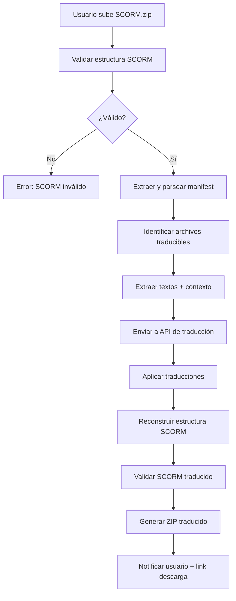

# CLAUDE.md - Manual Maestro para Claude

**PROYECTO**: Traductor SCORM
**UBICACIÓN**: `.claude/` - Consultado por Claude en cada interacción significativa
**ÚLTIMA ACTUALIZACIÓN**: 2025-11-25

---

## 🎯 PROPÓSITO Y WORKFLOW OBLIGATORIO

**ANTES de cualquier acción técnica, Claude DEBE**:
1. ✅ Leer **PRD.md** → Entender QUÉ construir y los acceptance criteria
2. ✅ Leer **BACKLOG.md** → Identificar EPIC/STORY actual y prioridades
3. ✅ Leer **STATUSLOG.md** → Verificar estado actual y decisiones previas

**DESPUÉS de cualquier acción significativa, Claude DEBE**:
1. ✅ Actualizar **STATUSLOG.md** con nueva entrada en Activity Log
2. ✅ Documentar decisión, rationale, implementación y next steps
3. ✅ Actualizar Current Focus si cambia el foco de trabajo
4. ✅ Registrar ADR si es decisión arquitectónica

**PROTOCOLO DE ESCALACIÓN**:
- Si hay ambigüedad en requirements → Preguntar al usuario antes de implementar
- Si hay conflicto entre PRD y petición del usuario → Señalarlo y pedir clarificación
- Si algo falla → Documentar en STATUSLOG antes de intentar fix
- Si se necesita decisión arquitectónica → Crear ADR entry y esperar aprobación si es major

---

## 🏗️ PROYECTO CORE

### Product Vision

**Sistema traductor de paquetes SCORM** para equipos de e-learning que necesitan localizar contenido educativo a múltiples idiomas.

**Problema que resuelve**:
- ⏱️ **Automatización**: Traducir paquetes SCORM manualmente es tedioso y propenso a errores
- 🌍 **Multiidioma**: Soportar SCORM 1.2, 2004 y xAPI/TinCan para múltiples idiomas
- 🤖 **IA**: Usar traducción automática de calidad para acelerar el proceso
- 📦 **Integridad**: Mantener la estructura y funcionalidad del SCORM original

**Success Criteria MVP**:
- Traducir correctamente un paquete SCORM 1.2 completo sin romper funcionalidad
- Interfaz web intuitiva: upload → seleccionar idiomas → download traducido
- API REST documentada para integración con otros sistemas
- Soporte para al menos 5 idiomas principales (ES, EN, FR, DE, IT)

### Current Focus
**Fase actual**: Setup inicial - Estructura de proyecto y documentación
**Sprint**: Sprint 0 - Foundation
**Próximo milestone**: Configurar FastAPI + parsear estructura SCORM 1.2

---

## 🛠️ ARQUITECTURA TÉCNICA

### Stack Tecnológico

| Layer | Tecnología | Justificación |
|-------|-----------|---------------|
| **Backend API** | FastAPI | Async nativo, validación automática con Pydantic, docs auto-generadas |
| **Frontend** | React + Vite | SPA moderna, desarrollo rápido, HMR |
| **Procesamiento SCORM** | Python libs custom | Parsing XML (manifest), HTML, procesamiento de archivos |
| **Traducción IA** | OpenAI API / Anthropic Claude | Traducción contextual de calidad, manejo de terminología técnica |
| **Storage** | Supabase Storage | Almacenamiento temporal de archivos SCORM, gestión de usuarios |
| **Database** | Supabase PostgreSQL | Tracking de traducciones, usuarios, historial |
| **Task Queue** | Celery + Redis | Procesamiento asíncrono de traducciones largas |
| **Containerización** | Docker + Docker Compose | Desarrollo consistente, deploy fácil |

### Arquitectura del Sistema

```
traductor-scorm/
├── backend/                    # FastAPI backend
│   ├── app/
│   │   ├── api/               # Endpoints REST
│   │   │   ├── v1/
│   │   │   │   ├── translation.py    # POST /translate, GET /status/{id}
│   │   │   │   ├── scorm.py          # GET /scorm/validate
│   │   │   │   └── languages.py      # GET /languages
│   │   ├── core/              # Configuración, seguridad, dependencies
│   │   │   ├── config.py
│   │   │   ├── security.py
│   │   │   └── celery_app.py
│   │   ├── models/            # Pydantic models
│   │   │   ├── scorm.py
│   │   │   ├── translation.py
│   │   │   └── user.py
│   │   ├── services/          # Lógica de negocio
│   │   │   ├── scorm_parser.py       # Parsear SCORM 1.2/2004/xAPI
│   │   │   ├── translator.py         # Integración con APIs de traducción
│   │   │   ├── scorm_rebuilder.py    # Reconstruir SCORM traducido
│   │   │   └── storage.py            # Supabase Storage ops
│   │   ├── tasks/             # Celery tasks
│   │   │   └── translation_tasks.py
│   │   └── main.py            # FastAPI app entry point
│   ├── tests/
│   ├── pyproject.toml
│   └── Dockerfile
│
├── frontend/                   # React SPA
│   ├── src/
│   │   ├── components/
│   │   │   ├── UploadZone.tsx
│   │   │   ├── LanguageSelector.tsx
│   │   │   ├── TranslationProgress.tsx
│   │   │   └── DownloadButton.tsx
│   │   ├── pages/
│   │   │   ├── Home.tsx
│   │   │   ├── Dashboard.tsx
│   │   │   └── History.tsx
│   │   ├── services/
│   │   │   └── api.ts          # Cliente API
│   │   ├── App.tsx
│   │   └── main.tsx
│   ├── package.json
│   ├── vite.config.ts
│   └── Dockerfile
│
├── shared/                     # Tipos compartidos (TypeScript + Python)
│   └── types/
│       └── scorm_types.py
│
├── docker-compose.yml          # Orquestación local: backend, frontend, Redis, PostgreSQL
├── .env.example
└── README.md
```

**Filosofía de Arquitectura**:
- ✅ **Separation of concerns**: API, lógica de negocio, procesamiento SCORM separados
- ✅ **Async-first**: Traducciones pueden tardar minutos, usar Celery para procesamiento en background
- ✅ **Type safety**: Pydantic en backend, TypeScript en frontend
- ✅ **API-first**: Frontend consume API REST, permite integración con otros sistemas
- ✅ **Testeable**: Separación clara permite unit tests, integration tests, E2E tests

---

## 📦 PROCESAMIENTO SCORM

### SCORM 1.2 - Estructura

```
scorm-package.zip
├── imsmanifest.xml           # Manifest principal (metadata, organización, recursos)
├── adlcp_rootv1p2.xsd
├── ims_xml.xsd
└── content/
    ├── index.html            # Contenido HTML
    ├── styles.css
    ├── script.js
    └── assets/
        ├── images/
        └── videos/
```

**Elementos a traducir**:
1. **imsmanifest.xml**:
   - `<title>` de organizaciones y items
   - `<description>` si existe
   - Metadata (`<langstring>`)

2. **Archivos HTML**:
   - Texto visible en `<p>`, `<h1-6>`, `<span>`, etc.
   - Atributos `alt`, `title`, `placeholder`
   - NO traducir: código JavaScript, URLs, IDs, clases CSS

3. **Archivos JavaScript** (opcional, v2):
   - Strings literales de UI
   - Mensajes de error

### SCORM 2004 - Diferencias

- Secuenciación avanzada (`<sequencing>`)
- Manifests anidados
- Más metadata

### xAPI/TinCan - Diferencias

- No usa `imsmanifest.xml`
- Usa `tincan.xml` o `activity.json`
- Statements JSON

---

## 🤖 INTEGRACIÓN DE IA PARA TRADUCCIÓN

### Opción Recomendada: Claude API (Anthropic)

**Ventajas**:
- Contexto largo (200K tokens) → Puede procesar HTML completo con contexto
- Mejor manejo de terminología técnica e-learning
- Preserva formato HTML/XML
- Menos alucinaciones que otros modelos

**Prompt Strategy**:

```python
TRANSLATION_PROMPT = """
Eres un traductor experto de contenido e-learning.

TAREA:
- Traduce el siguiente contenido HTML de {source_lang} a {target_lang}
- PRESERVA toda la estructura HTML, atributos, IDs, clases
- NO traduzcas: código JavaScript, URLs, nombres de variables, IDs
- Mantén terminología e-learning estándar
- Traduce: textos visibles, atributos alt/title/placeholder

CONTEXTO DEL CURSO:
{course_context}

CONTENIDO A TRADUCIR:
{content}

IMPORTANTE: Devuelve SOLO el HTML traducido, sin explicaciones.
"""
```

### Alternativas:

| Servicio | Ventajas | Desventajas |
|----------|----------|-------------|
| **OpenAI GPT-4** | API estable, buena calidad | Contexto limitado (128K), más caro |
| **Google Translate API** | Rápido, económico | Menos contextual, puede romper HTML |
| **DeepL API** | Mejor calidad EU languages | Limitado a pocos idiomas, caro |

**Estrategia Híbrida (Recomendada)**:
1. Usar Claude/GPT-4 para contenido HTML complejo
2. Usar Google Translate para strings simples (títulos cortos)
3. Cache de traducciones para reutilizar bloques comunes

---

## 🔄 WORKFLOW DE TRADUCCIÓN

### Flujo Completo



### Estados de Traducción

1. **uploaded**: SCORM subido, en cola
2. **validating**: Validando estructura SCORM
3. **parsing**: Extrayendo textos traducibles
4. **translating**: Enviando a API de traducción (puede tardar minutos)
5. **rebuilding**: Reconstruyendo paquete SCORM
6. **completed**: Listo para descargar
7. **failed**: Error en algún paso (con mensaje descriptivo)

---

## 📋 MODELO DE DATOS

### Entidades Principales

```python
# models/translation.py

class TranslationJob(BaseModel):
    id: UUID
    user_id: UUID
    original_filename: str
    scorm_version: Literal["1.2", "2004", "xapi"]
    source_language: str
    target_languages: List[str]  # ["es", "fr", "de"]
    status: TranslationStatus
    progress_percentage: int
    created_at: datetime
    completed_at: Optional[datetime]
    download_urls: Dict[str, str]  # {"es": "url", "fr": "url"}
    error_message: Optional[str]

class ScormManifest(BaseModel):
    version: str
    title: str
    description: Optional[str]
    organizations: List[Organization]
    resources: List[Resource]
    metadata: Dict[str, Any]

class TranslatableContent(BaseModel):
    file_path: str
    content_type: Literal["xml", "html", "json"]
    original_text: str
    context: str  # Contexto del curso para mejor traducción
    translations: Dict[str, str]  # {"es": "texto", "fr": "texto"}
```

### Database Schema (Supabase)

```sql
CREATE TABLE translation_jobs (
    id UUID PRIMARY KEY DEFAULT gen_random_uuid(),
    user_id UUID REFERENCES auth.users(id),
    original_filename TEXT NOT NULL,
    scorm_version TEXT NOT NULL,
    source_language TEXT NOT NULL,
    target_languages TEXT[] NOT NULL,
    status TEXT NOT NULL,
    progress_percentage INT DEFAULT 0,
    created_at TIMESTAMPTZ DEFAULT NOW(),
    completed_at TIMESTAMPTZ,
    download_urls JSONB,
    error_message TEXT
);

CREATE TABLE translation_cache (
    id UUID PRIMARY KEY DEFAULT gen_random_uuid(),
    source_text TEXT NOT NULL,
    source_language TEXT NOT NULL,
    target_language TEXT NOT NULL,
    translated_text TEXT NOT NULL,
    context_hash TEXT,  -- Hash del contexto para invalidación
    created_at TIMESTAMPTZ DEFAULT NOW(),
    UNIQUE(source_text, source_language, target_language, context_hash)
);

-- Index para búsquedas rápidas en cache
CREATE INDEX idx_translation_cache_lookup
ON translation_cache(source_text, source_language, target_language);
```

---

## 🔐 SEGURIDAD Y PERMISOS

### Modelo de Autenticación v1

- **Auth**: Supabase Auth (email/password o OAuth)
- **Roles**: Usuario registrado (un solo rol en v1)
- **Permisos**: Usuarios solo ven sus propias traducciones (RLS en Supabase)

### Validaciones Críticas

```python
# Validar SCORM antes de procesar
def validate_scorm_package(zip_file):
    checks = [
        ("manifest_exists", has_manifest),
        ("valid_xml", is_valid_xml),
        ("correct_version", check_scorm_version),
        ("max_size", lambda: zip_file.size < 500_MB),
        ("no_malicious_files", scan_for_malicious_content)
    ]
    # ...
```

### Limitaciones de Seguridad

- **Max file size**: 500MB por SCORM
- **Rate limiting**: 10 traducciones/hora por usuario (free tier)
- **File scanning**: Antivirus en archivos subidos
- **Sandboxing**: Procesamiento en containers aislados

---

## ✅ CHECKLIST DIARIO PARA CLAUDE

### Antes de empezar cada sesión:
- [ ] He leído STATUSLOG.md para entender el estado actual
- [ ] Conozco el Current Focus de hoy
- [ ] He verificado que no hay blockers activos
- [ ] He revisado PRD.md para los acceptance criteria de la feature actual

### Después de cada implementación significativa:
- [ ] He actualizado STATUSLOG.md con nueva entrada en Activity Log
- [ ] He incluido Context, Decision, Rationale, Implementation, Files, Status, Next Steps
- [ ] Si es decisión arquitectónica, he creado ADR entry
- [ ] He actualizado Current Focus si cambió
- [ ] He verificado que los tipos Pydantic son correctos
- [ ] He seguido las convenciones PEP 8 y estructura del proyecto

---

## 📚 REFERENCIAS RÁPIDAS

### Archivos Clave

| Pregunta | Archivo a consultar |
|----------|---------------------|
| ¿Qué feature implementar? | `PRD.md` → Functional Requirements |
| ¿Cuál es la prioridad? | `BACKLOG.md` → High/Medium/Low Priority |
| ¿Qué se ha hecho ya? | `STATUSLOG.md` → Today's Activity Log |
| ¿Cuál es el estado actual? | `STATUSLOG.md` → Current Status |
| ¿Hay blockers activos? | `STATUSLOG.md` → Blockers & Risks |

### Comandos Útiles

```bash
# Backend development
cd backend
python -m venv venv
source venv/bin/activate  # Linux/Mac
pip install -e ".[dev]"
uvicorn app.main:app --reload

# Frontend development
cd frontend
npm install
npm run dev

# Docker (full stack)
docker-compose up --build

# Tests
cd backend
pytest tests/ -v

# Linting
ruff check .
mypy app/
```

### Standards de Código

**Python**:
- PEP 8 para estilo
- Type hints obligatorios
- Docstrings en formato Google
- Max line length: 100 caracteres

**TypeScript**:
- ESLint + Prettier
- Strict mode enabled
- Interfaces para props de componentes

---

**FIN DEL MANUAL MAESTRO**

Última actualización: 2025-11-25 (Creación inicial)
